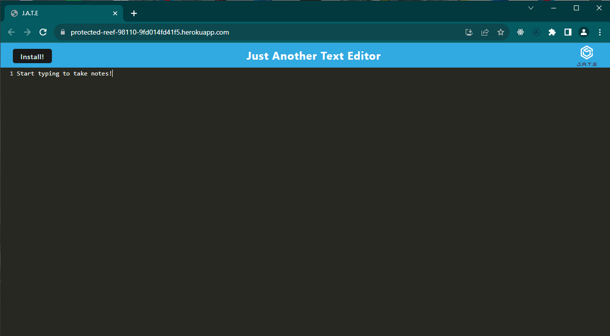
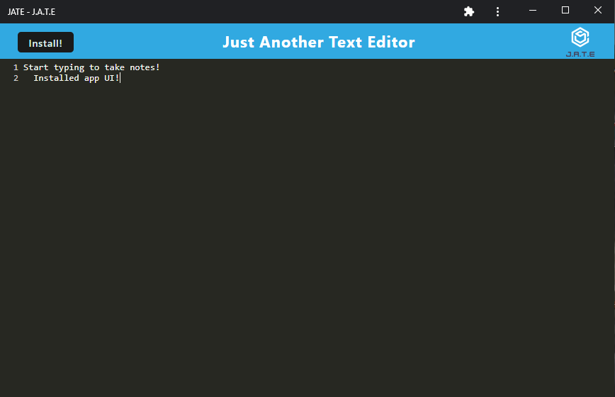

# JATE web-browser text editor

## Description

This is a web-broser base text editor which makes use of the technology provided by PWA (Progressive Web applications).
This project was made to be used on- and off-line, no matter where you are!

## Installation

Clone the repo and in VScode while inside the `Develop` folder run `npm install` and the `npm run build`.

After doing the previous step run the command: `npm run start:dev`.

In your browser enter `http://localhost:{port}/` in the port section substitute the value to the port you are using within the `Develop\server\server.js` file.

## Link to deployed page

[Deployed application](https://protected-reef-98110-9fd014fd41f5.herokuapp.com/)

Installed view:

## Credits

The project was done by me with some initial code provided by the bootcamp.